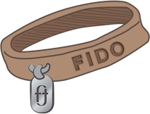

# Dogpark

A platform to easily integrate and manage the FIDO keys used in any organization.

## Introduction

Using a FIDO-compatible second factor authentication mechanism to better secure your web application is a **[good idea](https://fidoalliance.org/time-stop-using-sms-2fa-apps-two-factor-authentication/)**. But integrating all the Javascript and backend code necessary to enable FIDO 2nd factor authentication can be a daunting task. Even if you're able to integrate it all, the ability to manage and audit the FIDO keys in use in your organization is yet another set of functionality you'll have to create.

The Dogpark framework provides:
* simple Javascript integration with three straight-forward, Promised-based functions
* REST APIs to support the registration and login of FIDO keys
* an admin service (via REST API) to manage and audit the keys in use in your organization

Dogpark is created and sponsored by [ofte.io](https://ofte.io), a hardware-based platform that extends FIDO by adding *continuous authentication*.

## Concepts

#### Principals
Dogpark associates FIDO keys with *Principals*, or in other words, the people in your organization or those that use your service. Dogpark does not store any sensitive user information; all that is required is a `username` and `displayName`.

#### FIDO Keys
[FIDO protocols](https://fidoalliance.org/how-fido-works/) use standard public key cryptography techniques. A FIDO device (aka authenticator) can produce multiple key-pairs. Dogpark manages public keys generated by FIDO authenticators. More than one Key can be generated from an authenticator.

#### AAGUIDs
Groups of FIDO2-compliant authenticators are assigned what is known as an AAGUID (Authenticator Attestation Globally Unique ID). In order to preserve privacy of users, a hardware manufacturer will typically apply this ID to no fewer than 100,000 authenticators.

Dogpark allows you to audit and manage the AAGUIDs that are used in your organization. For instance you can create an AAGUID whitelist, allowing registration of authenticators from specific manufacturers only.

## Components

#### Javascript
The Dogpark Javascript makes it easy to deal with Principals and Keys in your single page app.

Include the JS.
```javascript
<script src="https://cdn.ofte.io/js/latest/ofte.js" 
    data-auth-service-url="https://dogpark-auth.example.com:2357">
</script>
```

There are a number of arguments that can be passed when the JS file is loaded.

* `data-auth-service-url`: The URL of your running auth service. Defaults to https://localhost:2357.
* `data-network-timeout`: The network timeout, in milliseconds, for HTTP requests. Defaults to 10,000 (10 seconds).
* `data-debug`: If true, log output of requests and other information to the browser console.

First, you need to inform Dogpark about the people (Principals) registering Keys. Typically this information will come from your backend or IDM.
```javascript
let principal = {
    username: 'hdt@walden.org,
    displayName: 'Henry D Thoreau',
    icon: 'https://kbimages1-a.akamaihd.net/e858c45e-a8cb-440c-9fb9-6308282cd3bb/166/300/False/henry-david-thoreau-7.jpg'
}

ofte.getOrCreatePrincipal(principal)
    .then(resp => {
        // success, continue onto register key
        console.log('principal', resp)
    })
    .catch(err => {
        console.log('error creating principal', err)
    })
```

Dogpark does not accept/store any private key data or passwords. As a *second factor* of authentication, it's expected that the *Principal* being created or retrieved is already authenticated by your platform.

Once a Principal has been established, you can register a new key.
```javascript
ofte.registerKey(principal.username)
    .then(key => {
        // success, continue onto login
        console.log('key registered', key)
    })
    .catch(err => {
        console.log('error registering key', err)
    })
```

This action produces the browser-directed flow for FIDO key registration. Once registered, you start the browser-directed flow for FIDO key login.

```javascript
ofte.loginKey(principal.username)
    .then(resp => {
        // success, continue to authenticated state
        console.log('successfully logged in', resp)
    })
    .catch(err => {
        console.log('error logging in key', err)
    })
```

#### Auth Service
The Dogpark Auth Service exposes a REST API that handles the creation of principals, and the registration and authentication of FIDO keys. If using the Dogpark JS (described above), there's no need to interact with this service.

The Service is designed to run as a micro-service. It is stateless therefore multiple instances can be deployed as needed. Both this Service and the Admin Service are easily deployed using Docker, see #Deploying below. Both services expose a `/healthz` endpoint for container orchestration.

#### Admin Service
The Dogpark Admin service offers an API to manage and audit the keys in use in your organization. Principals, Keys and AAGUIDs can be managed.

**Note: The Admin Service in this repo should be used as a starting point for your admin UI/API. As implemented in this repo, the Admin service is not protected by any authentication or authorization mechanism.**

The REST API is documented [here](https://online.swagger.io/?url=https://raw.githubusercontent.com/ofte-auth/dogpark/master/cmd/spec/admin.yaml).

An example VueJS-based Dogpark admin portal is available in our example code repo: https://github.com/ofte-auth/code/tree/master/example/admin. If you use the [supplied Docker Compose file](workspace/services.yml), an instance of the example admin portal is available at port 2359.


## Building
We develop and test "container-ready" and all of our [tooling](./Makefile) reflects that.

```shell
$ make container-build
```

will build the two services and a database migration container and tag them, ready for use by Docker Compose or whatever orchestration mechanism you use.

## Running
In the default configuration, the Dogpark platform is set up to run in a container manager (like Docker Compose or Kubernetes). There are a few external dependencies and environment variables that must be supplied to both Services.

#### Geo IP
The Services use IP-based geo-location for some API responses and auditing. We like ipstack's REST API—sign up for a limited, free account at ipstack.com. If you want to use a different GeoIP mechanism, you can roll your own by implementing [the Resolver interface](internal/geo/resolver.go). Support for MaxMind GeoLite is also in that directory (but the DB file is not included in this repo).

Environment Variable: `OFTE_IPSTACK_ACCESS_KEY`

#### FIDO Alliance Meta Data Service (MDS)
This is optional, but the Services can reach out to the FIDO Alliance MDS to pull detailed AAGUID information when a Key is registered. Create an account and get an access token: https://mds2.fidoalliance.org/tokens/

Environment Variable: `OFTE_FIDO_MDS_TOKEN`

#### Postgresql Password
In the default configuration, Dogpark uses a Postgresql container. You only need to specify the password with which you want the DB to be initialized.

Environment Variable: `OFTE_DB_PASSWORD`

---

If you're running locally, these are the only environment variables required. By convention, we store these in a `.env` file in the `workspace` folder.

Bring up the containers:

```shell
$ cd workspace
$ docker-compose -f services.yml up
```

In order to deploy somewhere other than localhost, you'll need to set these environment vars.

| Variable | Description  |
|-------|--------|
| OFTE_CORS_ALLOWED_ORIGINS | Restrict access to the APIs from specific domains. You can leave this as `*` (any domain), but that would not be secure. |
| OFTE_TLS_CERTIFICATE_FILE | The TLS cert for the domain on which the services are running |
| OFTE_TLS_PRIVATE_KEY_FILE | The TLS private key for the domain on which the services are running |
| OFTE_RP_DISPLAY_NAME | The name of the *Relying Party* For instance, 'Example, LLC'|
| OFTE_RP_ID | The Relying Party ID. The subset of the domain is acceptable. For instance `example.com`, would be correct for `app.example.com` and `admin.example.com`. [Read the spec.](https://w3c.github.io/webauthn/#dom-publickeycredentialcreationoptions-rp)|  
| OFTE_RP_ORIGIN | The Relying Party Origin. For instance, `https://example.com` |

In the [workspace/services.yml](workspace/services.yml) file, you can review all the environment variables in use.

## Auditing
The Admin Service REST API offers access to Dogpark auditing. All actions are logged and can be retrieved by various attributes (see the [Admin REST API documentation](https://online.swagger.io/?url=https://raw.githubusercontent.com/ofte-auth/dogpark/master/cmd/spec/admin.yaml)). In addition to this, you can supply a Message Broker (via the OptionMessageBroker) to the Services that implements the go-micro [Broker Interface](https://github.com/micro/go-micro/v2/broker). If present, all audit entries will also be sent through the broker.

## Dependencies
* golang v1.13+
* gosec v2.2+ (if checking security)
* docker v19.03+ (if building the containers)
* docker-compose v1.25+ (if deploying the containers)

#### Golang libraries used
* [gorm](https://github.com/jinzhu/gorm)
* [go-chi](https://github.com/go-chi/chi)
* [duo-labs/webauthn](https://github.com/duo-labs/webauthn)
* [logrus](https://github.com/sirupsen/logrus)
 
## Example Implementation

An example VueJS-based web application that uses Google OAUTH for first factor authentication and Ofte Dogpark for FIDO-based second factor authentication is available at [this repo](https://gitlab.com/ofte/example-portal-vuejs-golang/-/tree/ofte-dogpark).

## Contributing
Contributions are most welcome to this project should follow the standard git model:

	fork ➝ feature-branch ➝ pull-request 
	
Please base your pull request against our master branch and be sure to include details/reason for the change as well as the testing that was performed against the change.

## Resources

https://webauthn.guide
https://fidoalliance.org
https://www.okta.com/security-blog/2019/05/the-ultimate-guide-to-webauthn-registration-and-auth-flows/

